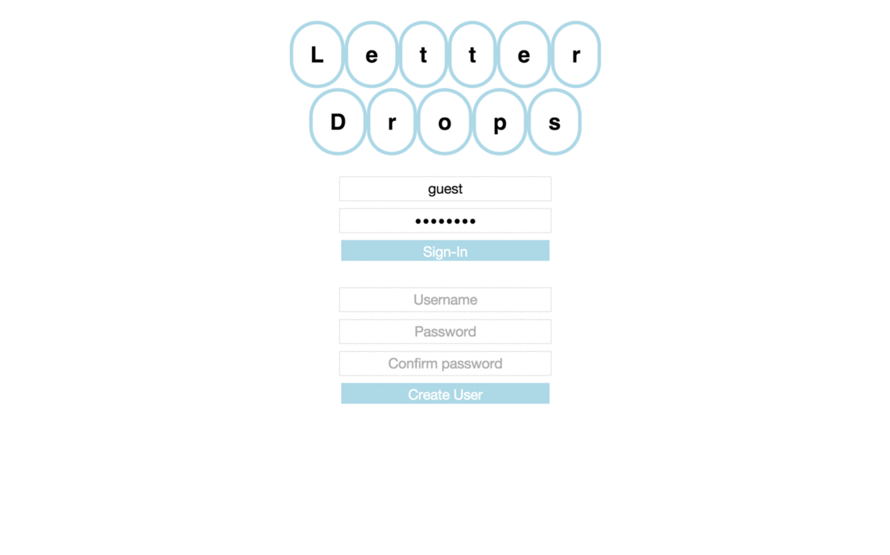

LetterDrops: A game to learn the ABCs and keyboard keys

***Instructions***
This is a javascript-driven video game intended to help children learn the ABCs and keyboard keys.

The game is broken up into three levels:
- Alphabetized: "droplets" of letters fall from the top of the screen. They fall in alphabetical order. The user must "pop" the droplets before they fall off of the screen by pressing the corollary letter on the keyboard.

- Randomized: This level follows the same process as Alphabetized, but the droplets fall in a random order.

- Words: This level provides static droplets with entire words. The user must type out the entire word for the droplet to pop. If a word is misspelled, the user can erase what was written with the delete button.

***Technologies Used***
HTML&CSS, Javascript/jQuery, Ruby, Ruby on Rails, text file from the Guttenberg Library to generate lines from the Persian Fairy Tales.

